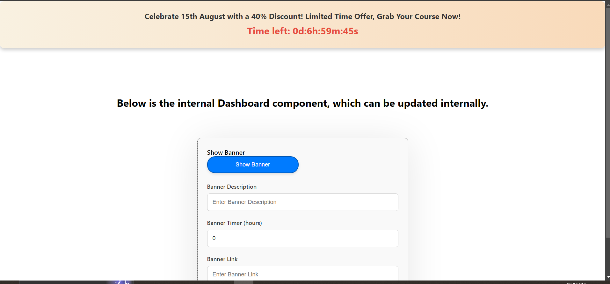

# TUF Assignment

## Project Overview

This project is a dynamic one-page website built with React. It includes a banner with a controllable visibility feature and a countdown timer. An internal dashboard allows you to manage the banner's content, visibility, timer, and clickable link. The backend is integrated with a MySQL database to store and manage the banner data.

##Important Points:

- **This code is for Backend, If you want to see the code of the frontend then go to another repository- [https://github.com/alk-alok/frontend-tuf-task](https://github.com/alk-alok/frontend-tuf-task)**
- **Deployment**: I have deployed frontend at netlify :- [click me](https://66bc8a10d98256872057f348--darling-zuccutto-4b6864.netlify.app/)

  

## Features

- **Banner Management:** 
  - Retrieve banner details from the database.
  - Update banner content including description, timer, link, and visibility.

## Prerequisites

- Node.js
- MySQL
- dotenv (for environment variables)

## API Endpoints

- **GET /api/v1/banner**: Retrieve the current banner data.
- **POST /api/v1/update-banner**: Update banner data in the database.

## Contact

For questions or support, please contact [kumaralok47ak@gmail.com](mailto:kumaralok47ak@gmail.com).
